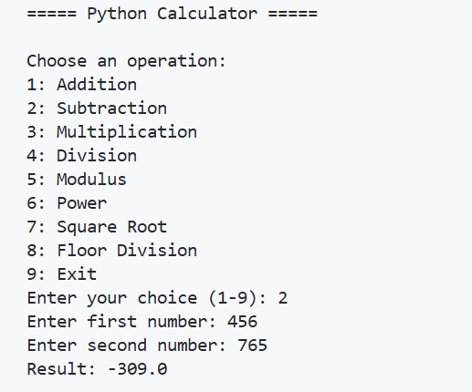
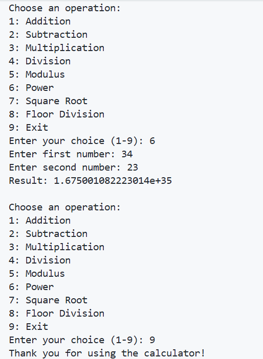

# Python Calculator

This is an Python calculator with multiple arithmetic operations, error handling, loops, and additional mathematical features.  
It is a beginner-friendly project 

---

## 🚀 Features
- Addition  
- Subtraction  
- Multiplication  
- Division  
- Modulus (%)  
- Power (a^b)  
- Square Root  
- Floor Division  
- Exit Option  
- Error Handling  
- Runs Continuously Until User Exits  

---

## 🧠 What I Learned
- Loops (`while True`)
- Functions & Logic Building  
- Error handling using `try-except`  
- Using Python's `math` module  
- Creating a simple user menu  

---

## 📌 How to Run
1. Install Python 3  
2. Save the file as `calculator.py`  
3. Run using: python calculator.py

## 📸 Output Screenshots

Here are some screenshots of the advanced calculator in action:

### Subtraction Example

### Power & Exit Example

## 📄 License
Free to use and modify